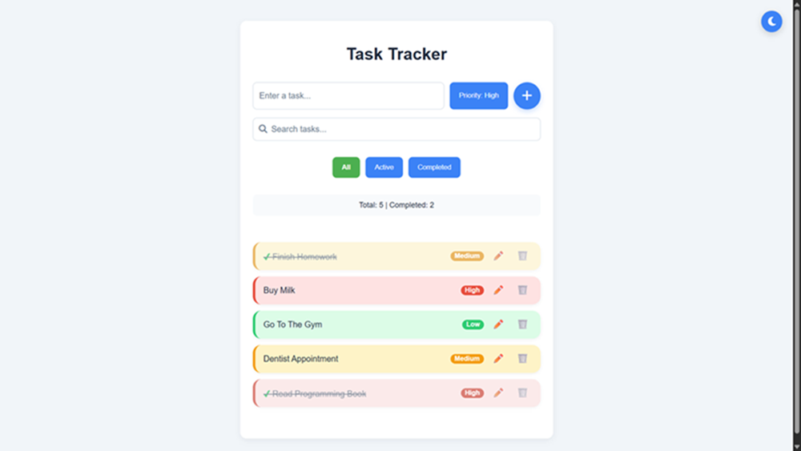
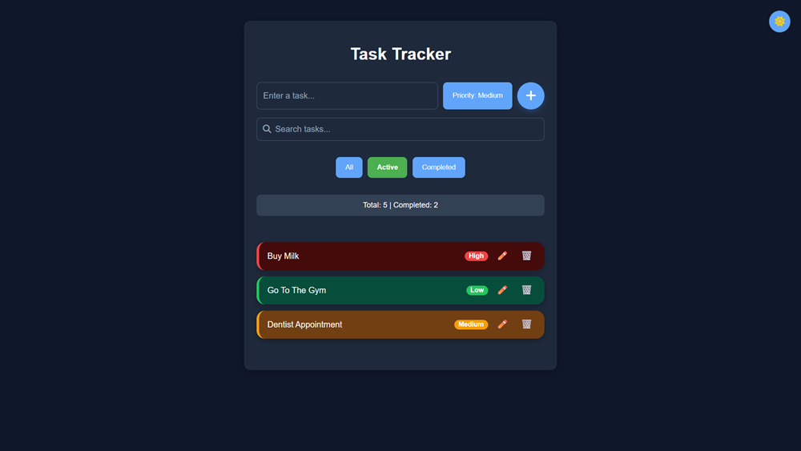

# Task Tracker ✅

A responsive task management application built using **HTML, CSS, and JavaScript**.

The app allows users to create, organise, search, and manage tasks with priority levels and a dark mode interface.

---

## Features

✅ Add new tasks  
✅ Edit existing tasks  
✅ Delete tasks  
✅ Mark tasks as completed  
✅ Search through tasks  
✅ Filter tasks by status:
- All
- Active
- Completed

✅ Priority system:
- High
- Medium
- Low

✅ Dark mode toggle  
✅ Saves tasks using Local Storage  
✅ Responsive design for different screen sizes  
✅ Accessible buttons and form labels  

---

## Technologies Used

- HTML5
- CSS3
- JavaScript (ES6)
- Local Storage API
- Font Awesome Icons

---

## How It Works

Tasks are managed using a JavaScript array that stores the current application state. Any changes update the array, save the data to Local Storage, and refresh the interface.

When a task is added, edited, completed, or deleted:

1. The task data updates
2. Changes are saved to Local Storage
3. The interface re-renders to show the latest data

This means tasks remain available even after refreshing the page.

---

## Screenshots

### Main Interface

### Dark Mode

---

## Live Demo

_Add your deployed project link here if you publish it using GitHub Pages, Netlify, or another hosting service._

Example:

---

## Future Improvements

Possible features to add:

- Due dates
- Task categories
- Drag and drop sorting
- Better inline editing
- Task completion animations
- Priority sorting

---

## Project Structure

---

## Author

Created by **Tim Baker**

Built as a JavaScript learning project focused on DOM manipulation, state management, local storage, and responsive UI design.